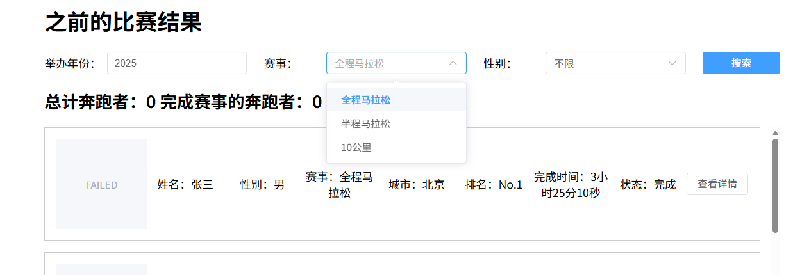
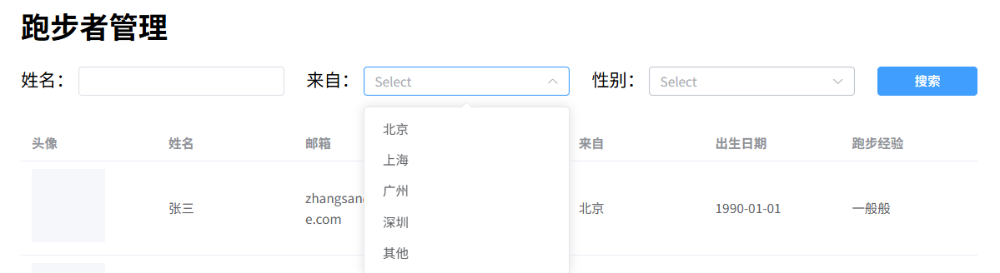
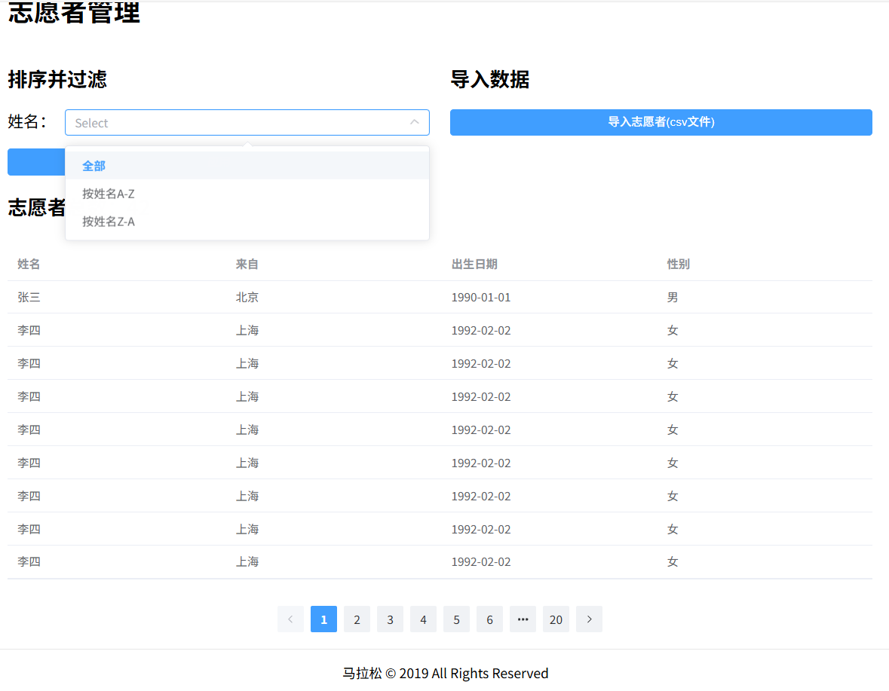

1. 不需要如下接口
    - POST,PUT,DELETE /api/competitions
    - GET /api/registrations
    - POST,PUT /api/results
    - PUT,DELETE /api/volunteers/{id}
2. 查询之前的比赛结果列表，接口缺少条件

3. 跑步者查询接口缺少参数

4. 志愿者模块缺少业务

> **上面所有的图片都是原型上的**